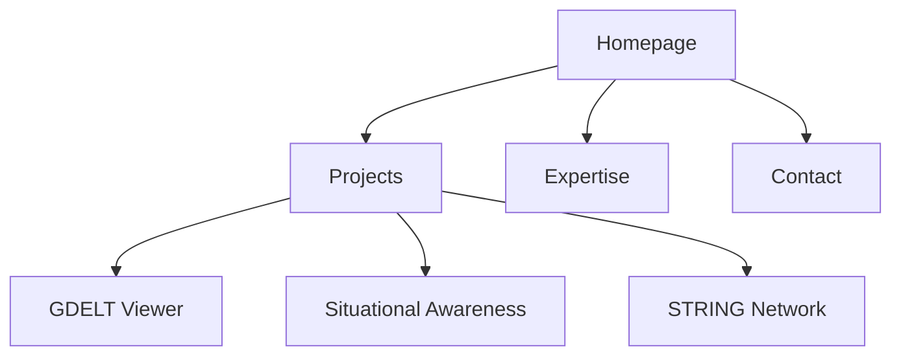

# Don Branson - AI Engineer & Solutions Architect

![[Book.jpeg]]

*(Source: https://datahub.io/@olayway/docs/Markdown%20syntax%20support)*

## Technology Stack

<div class="middle-button-container">
    <a href="#projects" class="middle-button">View Projects</a>
</div>

- **Core Framework**: React 18+ with TypeScript
- **Build Tool**: Vite
- **Styling**: Tailwind CSS + shadcn/ui components
- **Data Visualization**:  
  - ECharts  
  - Cytoscape.js  
  - Leaflet
- **State Management**: React Router
- **Deployment**: GitHub Pages

> [!important]
> All projects emphasize responsible AI development and deployment practices

---

## Featured Projects

<a name='projects'></a>

### GDELT GKG Viewer  
**Technologies**: React, Leaflet, Tailwind CSS  
```plaintext
Interactive viewer for GDELT Global Knowledge Graph with:
- Searchable record list
- Tone analysis dashboards
- Multi-version data toggling
- Geographic mapping integration
```

<div class="middle-button-container">
    <a href="/assets/projects/gdelt" class="middle-button">Live Demo</a>
    <a href="https://gist.github.com/donbr/e2af2bbe441f90b8664539a25957a6c0" class="middle-button">View Pipeline</a>
</div>

---

### Situational Awareness Graph  
**Technologies**: ECharts, NetworkX, React  
```plaintext
Network visualization system featuring:
- Disaster response mapping
- Cybersecurity threat analysis
- Supply chain disruption modeling
- Real-time data updates
```

<div class="middle-button-container">
    <a href="/assets/projects/situational-awareness" class="middle-button">Explore Visualization</a>
</div>

---

### STRING Network Viewer  
**Technologies**: Cytoscape.js, TypeScript  
```plaintext
Protein interaction analysis tool with:
- Dynamic network layouts
- Biological entity highlighting
- Cross-platform compatibility
```

<div class="middle-button-container">
    <a href="/assets/projects/cytoscape" class="middle-button">View Protein Networks</a>
</div>

---

## Core Expertise

<div class="grid md:grid-cols-2 gap-8">

### AI/ML Specializations
- Large Language Models (LLMs)
- Computer Vision Systems
- RAG Architectures
- AI Safety Protocols

### Engineering Practices
- MLOps/LLMOps
- Cloud-Native Solutions
- Graph Data Science
- Real-Time Analytics

</div>

> [!tip]
> See [Projects Page](#projects) for implementation examples

---

## Certifications

<div class="grid grid-cols-2 gap-4">

- **AI Makerspace**: Certified AI Engineer (2024)
- **Microsoft Azure**: AI Engineer & Solutions Architect
- **Neo4j**: Graph Data Science Professional
- **AWS**: Generative AI Essentials

</div>

---

## Contact

<div class="middle-button-container">
    <a href="https://github.com/donbr" class="middle-button">GitHub Profile</a>
    <a href="https://www.linkedin.com/in/donbranson/" class="middle-button">LinkedIn</a>
</div>

> [!note]
> For project collaboration inquiries, use LinkedIn messaging

---



<div class="middle-button-container">
    <a href="https://datahub.io/@olayway/docs" class="middle-button">View Full Documentation</a>
</div>
